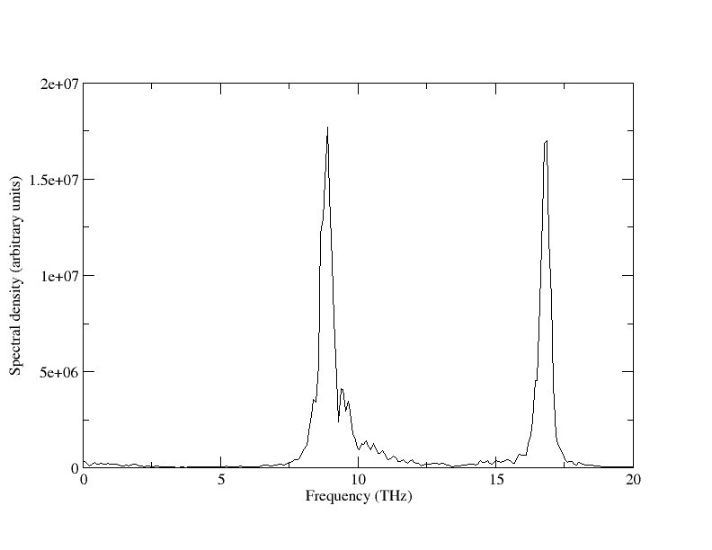

# phonon-lifetimes.py

A simple (cluttered) python script to compute phonon power-spectra of cubic
cells, 
corresponding frequencies, and phonon-lifetimes from atomic positions as, e.g.,
obtain by molecular dynamics. The accompanying paper can be found following the following link
https://journals.aps.org/prl/abstract/10.1103/PhysRevLett.123.235501

__How to get:__  
git clone https://github.com/glensk/phonon-lifetimes

__How to use by example:__  
cd example_TiN  
tar -xf POSITIONs.tar.bzip2  
../phonon-lifetimes/phonon_lifetimes.py -fftpy -atoms 216 -ps -v --peaks 2 -dt 1 -sc 3 -a 4.24 -pd -write_ps_fitted -write_full_ps -write_smooth_in

__where__:  
 * python phonon-lifetimes.py -h (explanation of available options)
 * sc defines the supercell
 * atoms defines the number of atoms in the cell
 * dt is the timestep in fs
 * a is the lattice constant
 * ...

Plot corresponding powerspectra e.g. example_TiN/ps_smooth/ps_space_fft_1_1_1_12042.dat

